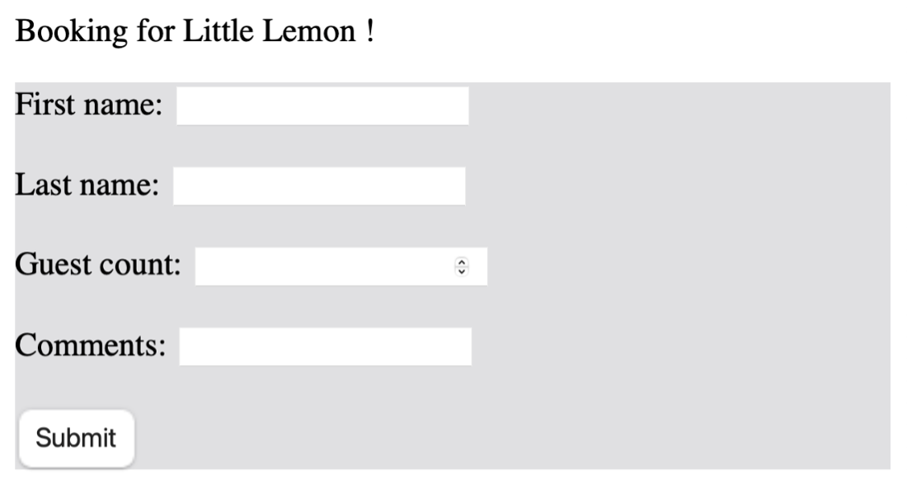
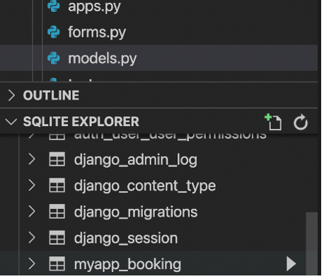
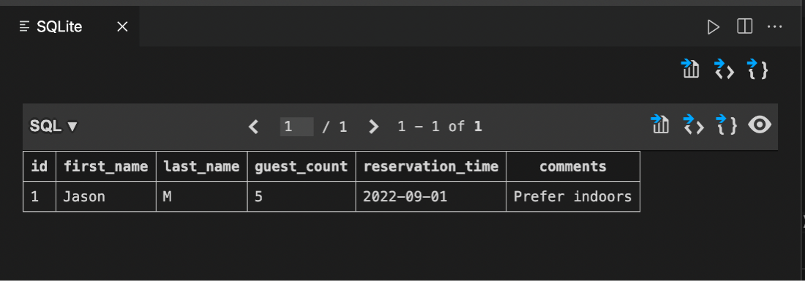

# Ungraded Lab

Working with Forms

## Core Information

- Instructor: Ajinkya Kolhe
- Course: Django Web Framework
- Module: 3 Models
- Lesson 2 Working with Forms
- Type: Ungraded Lab


### Goal

- Learner will create a ModelForm called BookingForm using the Booking model.

### Objectives

- The Learner will practice creating a ModelForm using a model.
- The Learner will add form fields to the form as per the instructions.
- The Learner will populate a database table with data entered from a form on a webpage.


### Introduction

In this lab, you will create a model form to accept user input on the Booking page.

The model form will be based on a model to connect with the database for storing the reservation requests received on Little Lemon website.

### Scenario

Adrian at Little Lemon would like to test the possibility of using a booking form on the website for online reservations. The purpose of the form will be to take a reservation request and store that request in a table in the database. Later it is hoped that a member of staff will be able to access and view this request from the Django administration control panel.

Before that functionally can be created, the first step is to build a proof of concept of the booking form on the website. And you have been assigned this task.

This lab will require you to modify the following files:

- models.py
- forms.py
- admin.py

Additionally, you are required to use the command line console inside the terminal of VS Code.

If not open already, go to 'Terminal' on the Menu bar at the top of your screen and select 'New Terminal'.


You have already built the project named 'myproject' and added an app inside the project called 'myapp'.

Follow the instructions below and ensure you check the output at every step and update the necessary files to create different views.

# Steps

**Step 1:**
 Open the ```models.py``` file and create a class called ```Booking``` inside it and pass ```models.Model``` to it.

**Step 2:**
 Create the five attributes you will require in the model and assign the respective form fields to them.

Additionally, pass the following arguments to those form fields:

| **Attribute** | **Form field type** | **Arguments** |
| --- | --- | --- |
| first\_name | CharField | max\_length = 200 |
| last\_name | CharField | max\_length = 200 |
| guest\_count | IntegerField |
| reservation\_time | DateField | auto\_now=True |
| comments | CharField | max\_length = 1000 |

**Step 3:**
Go to the ```'admin.py'``` file and register the Model you created by passing the model name to the function ```admin.site.register()```. Import the model in ```'admin.py'```

**Tip:** Make sure you have imported the model ```Booking``` inside the ```'admin.py'``` file.

**Step 4:**
Create a file in the ```myapp``` directory called ```'forms.py'``` and add the following:

- Import the ```Booking``` model from the file ```'models.py'```.
- Import the module ```forms``` from the package ```django```

**Step 5:**
Still inside the ```'forms.py'``` file, create a class called ```BookingForm``` and pass the ```forms.ModelForm``` as an argument to it.

**Step 6:**
Inside the class ```BookingForm``` , create another class called ```Meta``` and declare the following attributes inside it:

1. ```model``` with the value ```Booking```
2. ```fields``` with the value ```"__all__"```

**Step 7:**
 In the terminal run the command to make the migrations.

**Step 8:**
Run the command to perform the migrations.

**Step 9:** Open the ```'urls.py'``` file. Notice that the code to create the URL configuration is already created.

**Step 10:** Open the ```'views.py'``` file and remove all the comments from the code. Notice that the code to create the view function is already created.

The view is rendered using the template file which can be found under ```myapp > templates > 'booking.html'``` . Open the file and explore the contents.

**Note:** The template used in this lab is required for you to preview the form. Don't worry about how it functions yet. For now, focus on the process of how to work with forms in Django. You will learn how to work with templates in a later module.

**Step 11:**
Run the command to run the server and launch the browser at the localhost URL.

**Step 12:**
In the browser address bar, type the URL that will render the view that is configured to render the model form.


```http://127.0.0.1:8000/booking```

The view should appear as below:



**Note:** The ```DateField``` attribute has the parameter ```auto_now``` set to ```True``` and will not be displayed inside the form on the webpage.

**Step**  **13**** :**
Check that the form is rendered correctly on the webpage. Fill out the form with the following details.

| First name | Jason |
| --- | --- |
| Last name | Murphy |
| Guest count | 5 |
| Reservation time | 12-01-2022 |
| Comment | Prefer indoors |

**Step 14:** Inside the explorer pane in the left panel of VS Code, Right click on the database ```db.sqlite3``` that is generated and select 'Open Database'.

**Step 15:** Go to ```SQLITE EXPLORER```and click the arrow to expand it. 

Select ```db.sqlite3``` and scroll down to check if ```myapp_booking``` table is generated.

Click on the 'Show Table' button, or right-click and choose 'Show Table'.

**Step 16:** Check the data entered in the form is created in the database:

 | 

**Note:** The ```DateField``` attribute has the parameter ```auto_now``` set to ```True``` and will not be displayed inside the form on the webpage.

## Concluding thoughts

In this lab, you practiced creating a Model Form using a model. You also populated a database table with data entered from a form on a webpage.